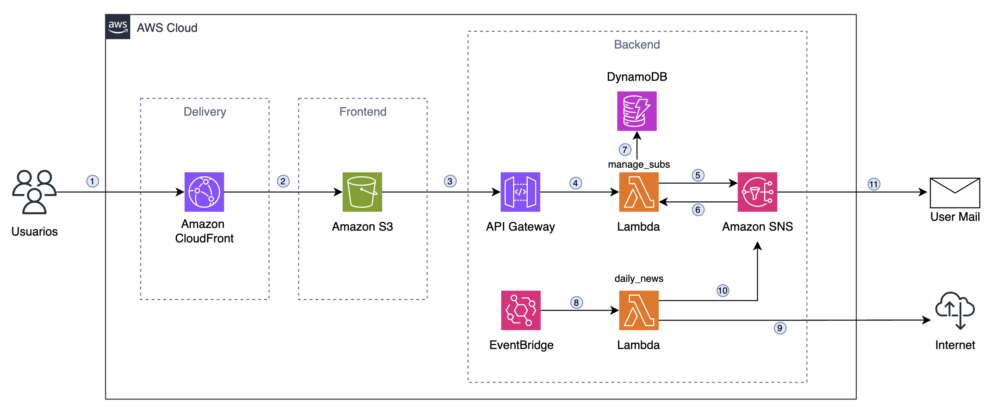

# 📰 DailyNewsBot

**DailyNewsBot** es una aplicación serverless en AWS que envía un newsletter diario con las principales noticias de tecnología de medios internacionales y locales.  
El proyecto combina un frontend estático para la gestión de suscriptores y un backend totalmente automatizado para recopilar noticias y enviarlas por correo cada noche a las 20:30 (hora Argentina).

---

## 🚀 Arquitectura

### Flujo del sistema

1. **Usuario → CloudFront**  
   El usuario accede a la aplicación mediante una URL de CloudFront, lo que permite un acceso rápido y seguro.

2. **CloudFront → S3**  
   CloudFront sirve el contenido estático almacenado en un bucket S3 (HTML, CSS, JS) que compone el frontend.

3. **S3 → API Gateway**  
   Desde el frontend, las solicitudes (suscripción, desuscripción, listado de correos) se envían a través de API Gateway.

4. **API Gateway → Lambda (manage_subs)**  
   API Gateway invoca la función Lambda encargada de manejar suscripciones/desuscripciones.

5. **Lambda (manage_subs) → SNS**  
   La Lambda se conecta con Amazon SNS para suscribir o eliminar direcciones de correo en el tópico de distribución.

6. **SNS → Lambda (manage_subs)**  
   SNS responde a la Lambda con el estado de la suscripción (PENDING, CONFIRMED).

7. **Lambda (manage_subs) → DynamoDB**  
   La Lambda también actualiza DynamoDB para mantener un registro persistente de los correos suscriptos.

8. **EventBridge → Lambda (daily_news)**  
   Un scheduler en EventBridge ejecuta cada día a las 20:30 (hora Argentina) la Lambda encargada de obtener las noticias.

9. **Lambda (daily_news) → Internet**  
   Esta Lambda recopila titulares de medios tecnológicos (ej: TechCrunch, The Verge, Wired, Xataka, GenBeta) mediante RSS o scrapers ligeros.

10. **Lambda (daily_news) → SNS**  
    Una vez generado el resumen, lo publica en el tópico de Amazon SNS.

11. **SNS → Email de usuarios**  
    SNS envía el newsletter directamente a todos los suscriptores confirmados.

---
## 🖥️ Demostración en CloudFront

[Demo - DailyNewsBot](https://d2g8iozk6iq1s3.cloudfront.net/)

---

## 🔒 Seguridad con IAM

La seguridad y los permisos en **DailyNewsBot** son manejados con **AWS IAM (Identity and Access Management)**:

- La Lambda `manage_subs` tiene permisos **mínimos necesarios** para interactuar con DynamoDB (CRUD en la tabla de suscriptores) y SNS (Subscribe, Unsubscribe, ListSubscriptions).  
- La Lambda `daily_news` tiene permisos para **publicar en SNS**.  
- CloudFront utiliza **OAC (Origin Access Control)** para restringir el acceso directo al bucket S3.  
- EventBridge y API Gateway solo pueden invocar las Lambdas asociadas.  

De esta forma, cada componente opera con el **principio de privilegio mínimo**, reforzando la seguridad general de la arquitectura.

---

## ⚙️ Tecnologías utilizadas

- **Frontend**:  
  - Amazon S3 (hosting estático)  
  - Amazon CloudFront (CDN + URL pública)  

- **Backend**:  
  - Amazon API Gateway  
  - AWS Lambda (manage_subs & daily_news)  
  - Amazon DynamoDB (persistencia de suscriptores)  
  - Amazon SNS (envío de newsletter por correo)  
  - Amazon EventBridge (scheduler)  

- **Seguridad y control de acceso**:  
  - AWS IAM (roles y políticas con privilegio mínimo)  

---

## 📅 Funcionamiento

- El usuario ingresa su correo en el frontend y lo confirma vía mail.  
- Cada día a las **20:30 (hora Argentina)**, los suscriptores reciben un resumen con las principales novedades tecnológicas.  
- Los correos pueden administrarse desde la misma interfaz (suscripción / desuscripción).

---

## 🧑‍💻 Autor

Proyecto desarrollado por **Ignacio Melinc** como parte de su portfolio de proyectos Cloud en AWS.
